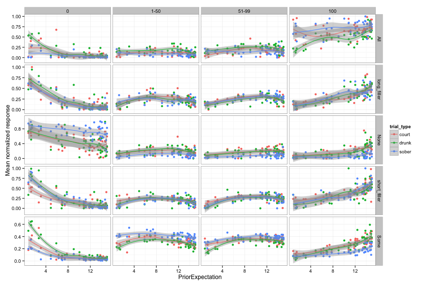
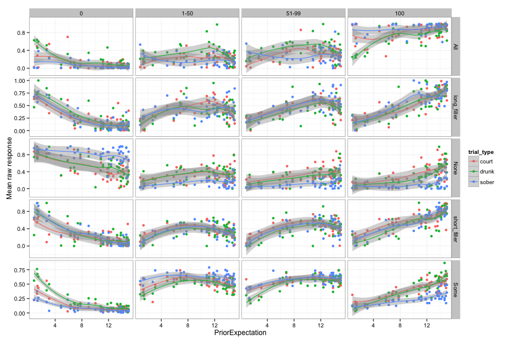
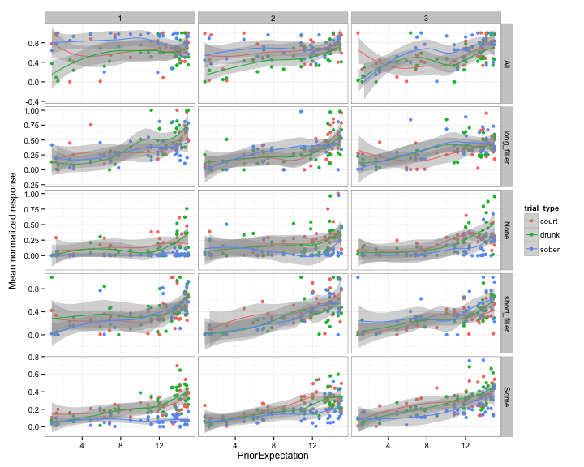
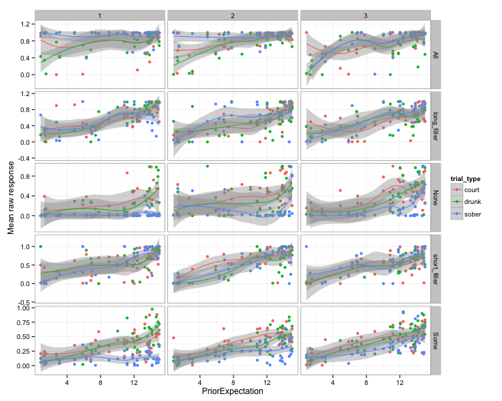

```r
load("results/data/r.RData")
```

Normalized mean responses by slider (column), quantifier (row), and trial type (color). We replicate the attenuated effect of the prior on "some" in the sober (reliable) speaker condition -- see lower right corner. In the same facet: when speakers are unreliable, listeners rely more on their priors -- as expected!! Though values still don't get quite as high as expected under standard RSA, but I think normalization is screwing us over here. The next plot (and three plots further down) shows the mean *raw* responses (split up by block), and it's very clear that here for the first time we're even close to approaching what RSA predicts. Also: interesting effects in the "all"/"none" conditions.

 

 

Normalized mean responses on 100%/all slider by block (column), quantifier (row), and trial type (color). Drunk/court are unreliable/uncooperative, sober is reliable. Clear effect of speaker reliability on "some", but values still not super high (normalization issue).

 

Raw mean responses on 100%/all slider by block (column), quantifier (row), and trial type (color). Drunk/court are unreliable/uncooperative, sober is reliable. Very clear effect of speaker reliability on "some", and for the first time, values approaching 1 in the unreliable case. This has never happened before!


 

